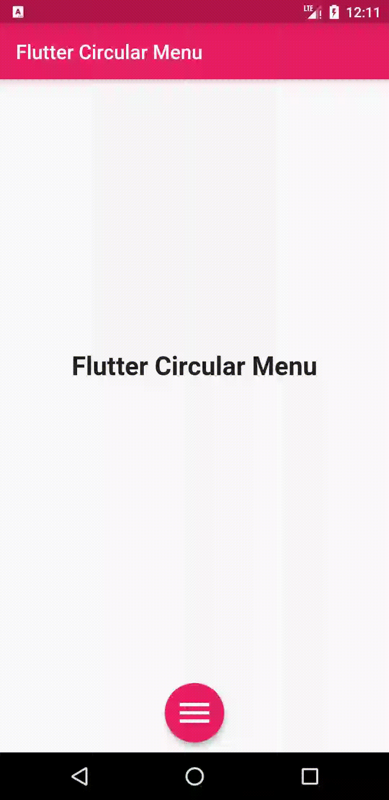
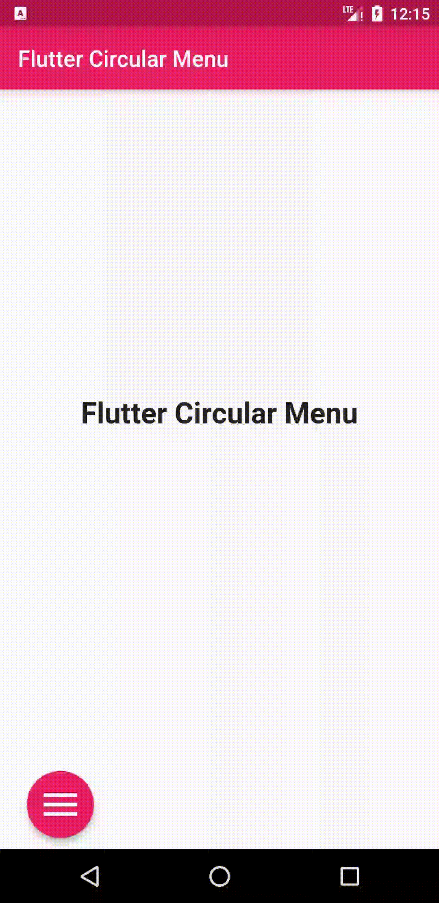
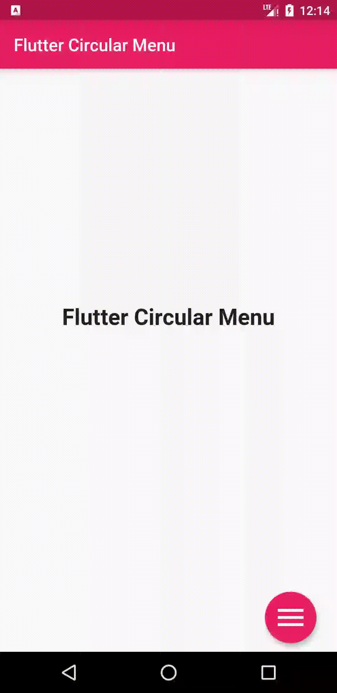
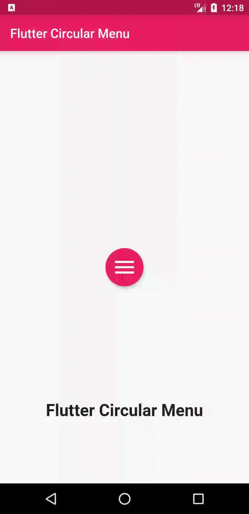
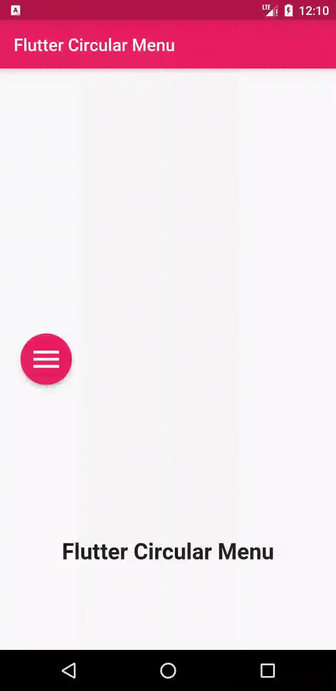
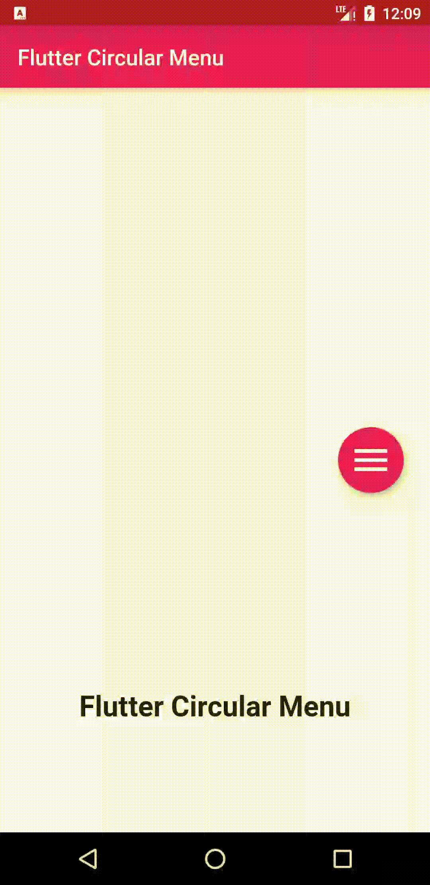
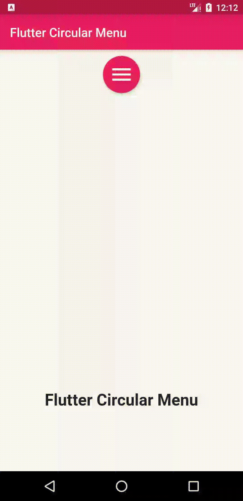
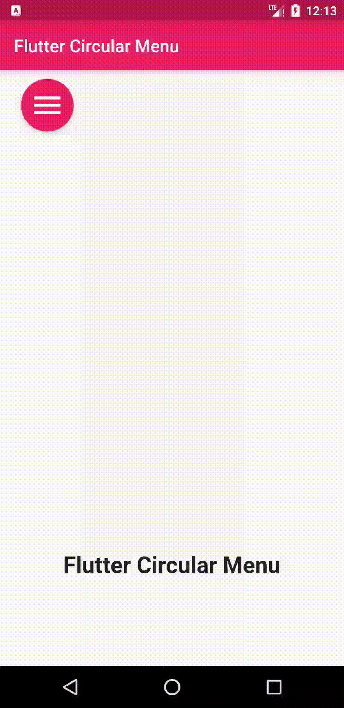
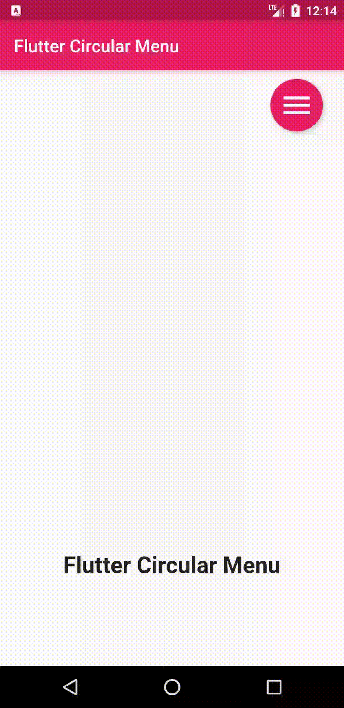

A simple animated circular menu for Flutter, Adjustable radius, colors, alignment, animation curve and animation duration.

[pub package](https://pub.dartlang.org/packages/circular_menu)

         
 

## Getting Started

- [Installation](#installation)
- [Basic Usage](#basic-usage)


### Installation

Add

```bash

 circular_menu : ^latest_version

```

to your pubspec.yaml, and run

```bash
flutter pub get
```

in your project's root directory.

### Basic Usage


Import it to your project file

```dart
import 'package:circular_menu/circular_menu.dart';
```

And add it in its most basic form like it:

```dart
final circularMenu = CircularMenu(items: [
    CircularMenuItem(icon: Icons.home, onTap: () {
      // callback
    }),
    CircularMenuItem(icon: Icons.search, onTap: () {
      //callback
    }),
    CircularMenuItem(icon: Icons.settings, onTap: () {
      //callback
    }),
    CircularMenuItem(icon: Icons.star, onTap: () {
      //callback
    }),
    CircularMenuItem(icon: Icons.pages, onTap: () {
      //callback
    }),
  ]);

```

There are additional optional parameters to initialize the menu with.

```dart
  final circularMenu = CircularMenu(
      // menu alignment
      alignment: Alignment.bottomCenter,
      // menu radius
      radius: 100,
      // widget in the background holds actual page content
      backgroundWidget: MyCustomWidget(),
      // global key to control the animation anywhere in the code.
      key: // GlobalKey<CircularMenuState>(),
      // animation duration
      animationDuration: Duration(milliseconds: 500),
      // animation curve in forward
      curve: Curves.bounceOut,
      // animation curve in reverse
      reverseCurve: Curves.fastOutSlowIn,
	// first item angle
      startingAngleInRadian : 0 ,
	// last item angle
      endingAngleInRadian : pi,
      // toggle button callback
      toggleButtonOnPressed: () {
        //callback
      },
      // toggle button appearance properties
      toggleButtonColor: Colors.pink,
      toggleButtonElevation: 4.0,
      toggleButtonIconColor: Colors.white,
      toggleButtonMargin: 10.0,
      toggleButtonPadding: 10.0,
      toggleButtonSize: 40.0,
      items: [
        CircularMenuItem(
          // menu item callback
          onTap: () {
            // callback
          },
          // menu item appearance properties
          icon: Icons.home,
          color: Colors.blue,
          elevation: 4.0,
          iconColor: Colors.white,
          iconSize: 30.0,
          margin: 10.0,
          padding: 10.0,
          // when 'animatedIcon' is passed,above 'icon' will be ignored
           animatedIcon:// AnimatedIcon(),
        ),
        CircularMenuItem(
            icon: Icons.search,
            onTap: () {
              //callback
            }),
        CircularMenuItem(
            icon: Icons.settings,
            onTap: () {
              //callback
            }),
        CircularMenuItem(
            icon: Icons.star,
            onTap: () {
              //callback
            }),
        CircularMenuItem(
            icon: Icons.pages,
            onTap: () {
              //callback
            }),
      ]);

```

control animation anywhere in your code using a key:


```dart
  GlobalKey<CircularMenuState> key = GlobalKey<CircularMenuState>();
  @override
  Widget build(BuildContext context) {
    return Scaffold(
      appBar: AppBar(
        backgroundColor: Colors.pink,
        title: Text(
          'Flutter Circular Menu',
          style: TextStyle(
            color: Colors.white,
          ),
        ),
      ),
      body: CircularMenu(
        alignment: Alignment.bottomCenter,
        startingAngleInRadian: 1.25 * pi,
        endingAngleInRadian: 1.75 * pi,
        backgroundWidget: Center(
          child: Row(
            mainAxisAlignment: MainAxisAlignment.spaceEvenly,
            children: <Widget>[
              MaterialButton(
                onPressed: () {
                  key.currentState.forwardAnimation();
                },
                color: Colors.pink,
                shape: RoundedRectangleBorder(
                    borderRadius: BorderRadius.circular(15)),
                padding: const EdgeInsets.all(15),
                child: Text(
                  'forward',
                  style: TextStyle(
                    color: Colors.white,
                    fontSize: 24,
                  ),
                ),
              ),
              MaterialButton(
                onPressed: () {
                  key.currentState.reverseAnimation();
                },
                shape: RoundedRectangleBorder(
                    borderRadius: BorderRadius.circular(15)),
                padding: const EdgeInsets.all(15),
                color: Colors.pink,
                child: Text(
                  'reverse',
                  style: TextStyle(
                    color: Colors.white,
                    fontSize: 24,
                  ),
                ),
              ),
            ],
          ),
        ),
        key: key,
        items: [
          CircularMenuItem(
            icon: Icons.home,
            onTap: () {},
            color: Colors.green,
            iconColor: Colors.white,
          ),
          CircularMenuItem(
            icon: Icons.search,
            onTap: () {},
            color: Colors.orange,
            iconColor: Colors.white,
          ),
          CircularMenuItem(
            icon: Icons.settings,
            onTap: () {},
            color: Colors.deepPurple,
            iconColor: Colors.white,
          ),
        ],
      ),
    );
  }
}

```
 


